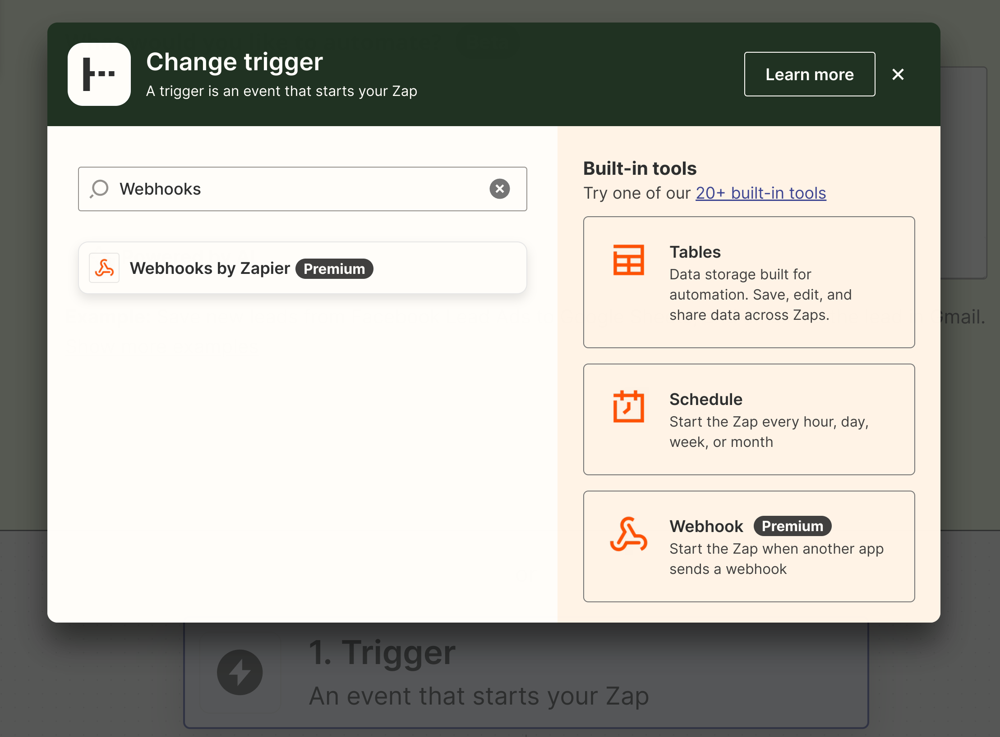
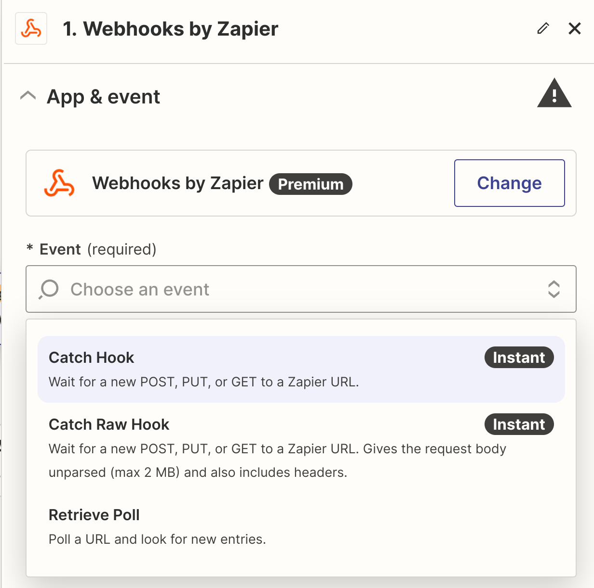
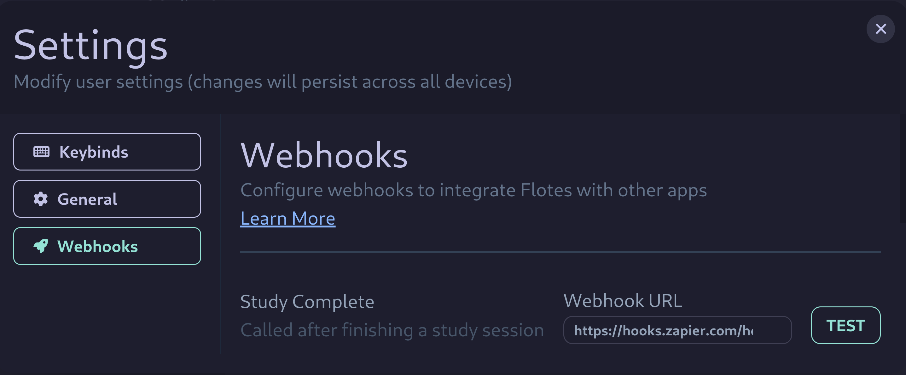
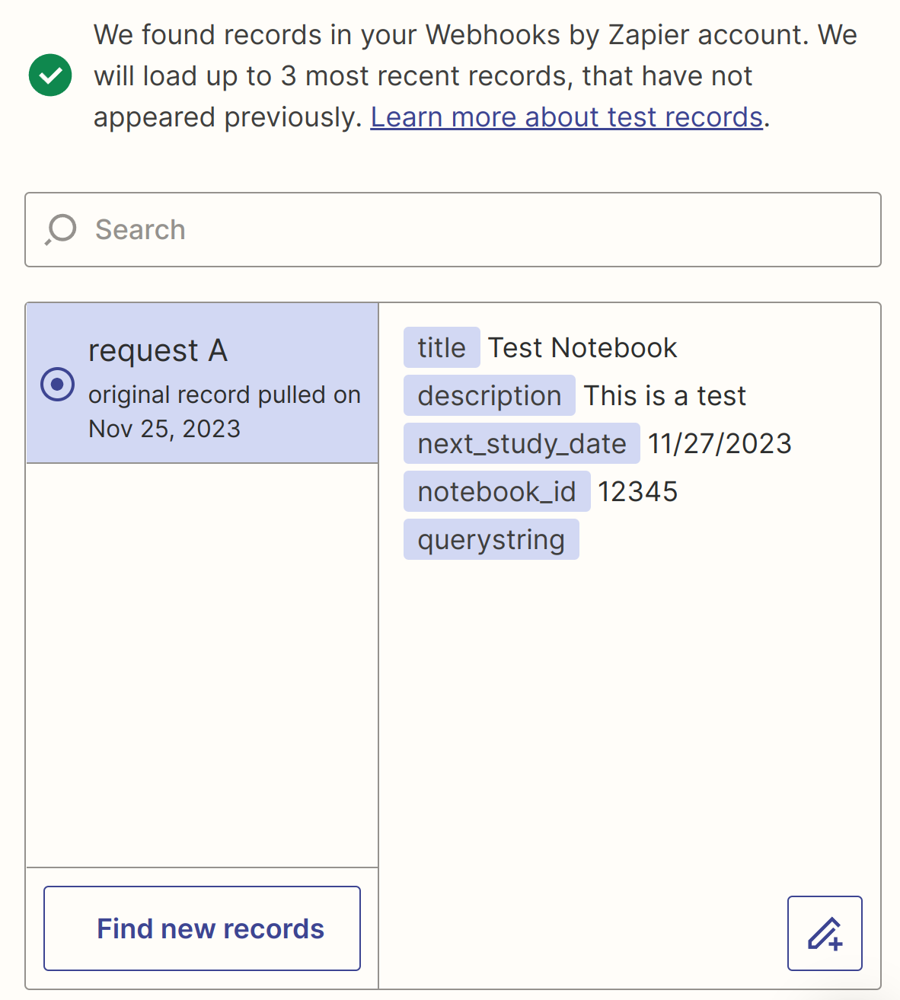
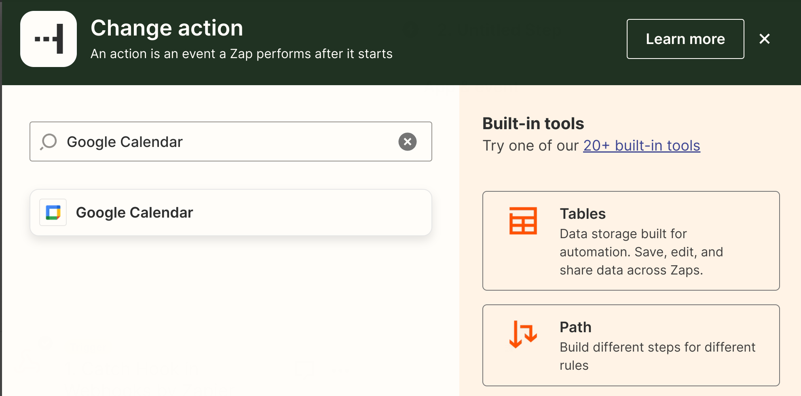
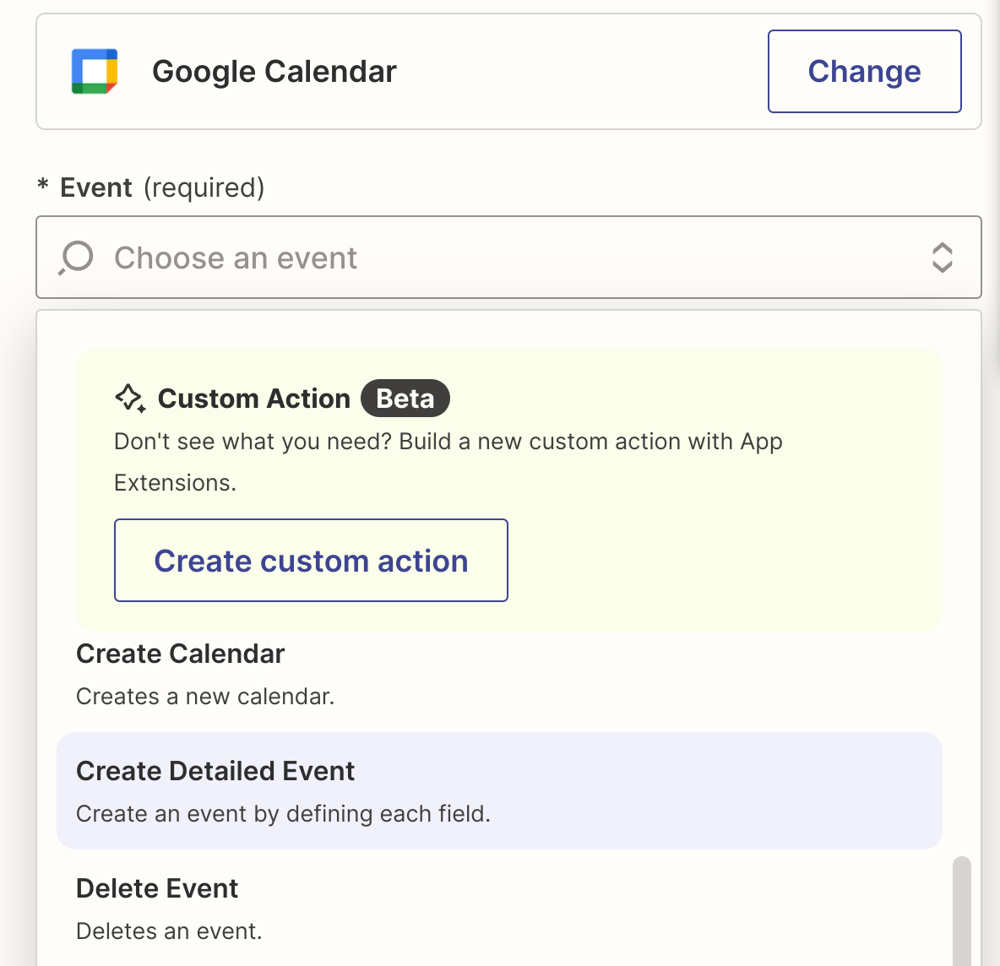
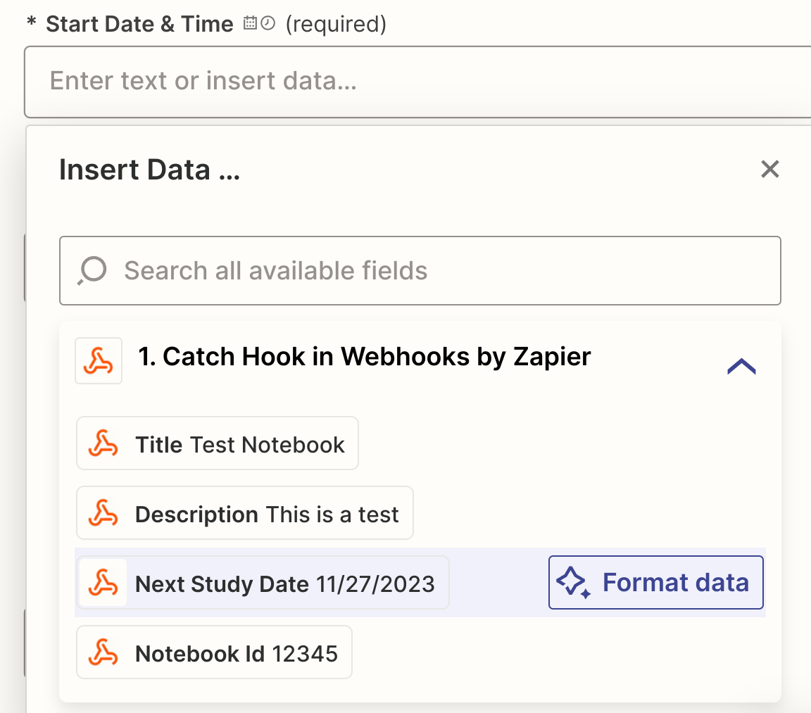
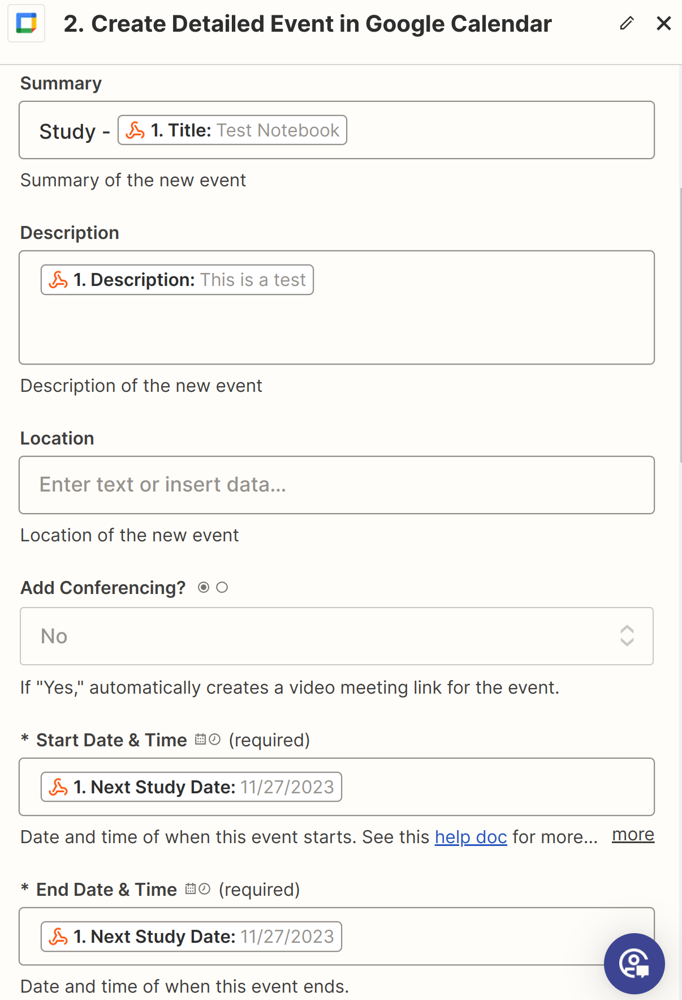
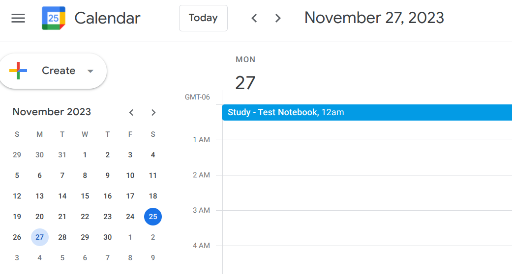
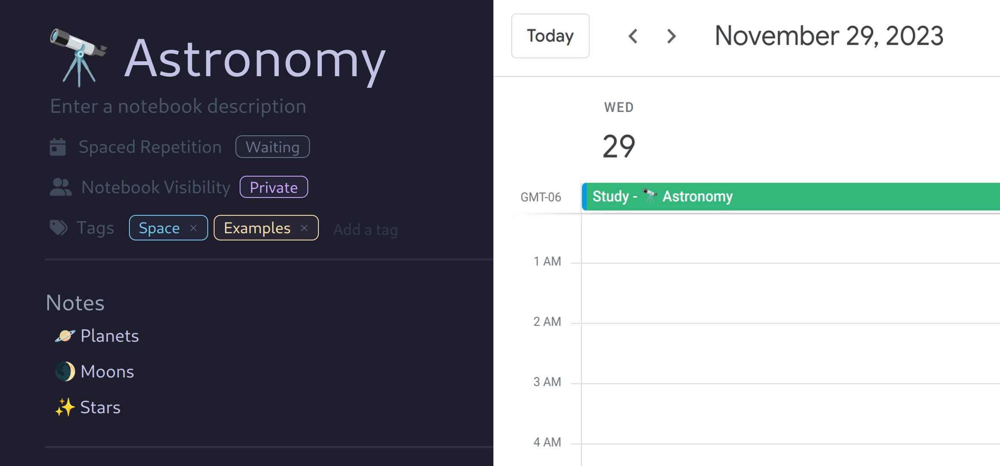

## What are Webhooks?

Webhooks are a way of sending data on an event or trigger. You can then use automation services like **Zapier** or **IFTTT** to perform an *action* when that data is received.

## Why Webhooks?

Webhooks allow users to integrate Flotes with just about any well-known application. With maximum flexibility and customization. 

Using the `on_study_complete` event as an example, you could schedule your next study session:
- As a Trello card
- As a Todoist todo
- As a database item in Notion
- As a note in Evernote
- As an event in Google Calendar

## Available Webhook Events


### On Study Complete
- Fired after completing a study session

**Payload**
```
title
description
next_study_date
notebook_id
```


### On Notebook Archived
- Fired after archiving a notebook
- `value` is all notes values, similar to what's shown on the **summary** screen.

**Payload**
```
title
description
value  
notebook_id
```


## Google Calendar Integration (Example)

When you complete a study session, Flotes can send data about that event (like the next scheduled study date) to a service like **Zapier**. You can configure a workflow in Zapier to do just about anything with that data.

In our example, when we complete a study session, we'll automatically schedule the next study date in our Google Calendar. 

:::note[Getting Help]

Setting up your first webhook can be intimidating. Webhooks seem like *magic* and that can make them difficult to understand. 

If you're stuck or having trouble, reach out for help on our [Discord](https://discord.com/invite/qKaKeGT8sZ)! 

:::

### Creating Your First Webhook

First create a new **"Zap"**. A Zap always starts with a *trigger*. Select **Webhooks by Zapier**
- **Important**: Webhooks are labeled *premium*. However, **You do not need Zapier premium** to use Webhooks like this.



When prompted for an *event*, select **Catch Hook**. 



**In Zapier**, you should see a **Webhook URL**. - **Copy this value**.

#### Configuring the Webhook in Flotes

Now, **open [Flotes](https://flotes.app/home)** and navigate to your Webhook configuration (preferences --> webhooks).

Paste the URL into the input labeled **Study Complete**. This Webhook will fire whenever you complete a study session. For now, we'll use Flotes *Test* button to manually test our Webhook.



**Press the "Test" Button** after adding your Webhook URL.

#### Receiving the Data in Zapier

Now, **Back in Zapier**, you should see a record found. This will display all of the data received from Flotes. The "Test" button sends fake data that we can use to validate our Zap.



Continue to the next step. This is where we determine **what happens when our Webhook receives an event**!

#### Setting up Google Calendar

Search for and select **Google Calendar**. You may be prompted to authenticate after selecting.



Select the type of Google Calendar event that you'd like to execute. For our example, we'll choose **Create Detailed Event**.



#### Setting Values

Remember the fields from our test run? Now, when we select a field, Zapier will **prompt us to choose one of those fields**.

For example, we can set the **Start Date & Time** to our **Next Study Date**.



We can also add any plain text in conjunction with these fields. For example, the title of our calendar event is `Study - [TITLE]`.

You can follow the example below. Or, fill out the various fields however you see fit.



### Publishing the Webhook

Now we're ready to publish. You can press the **Test button in Zapier** to manually test the complete process. If everything is configured correctly, you should see your event in your Google Calendar.



### Testing the Webhook Live

After studying, our notebook will move to the *waiting* state. Since we setup our Webhook, Flotes will also notify our Google Calendar of the next **optimal study date**. This is a really convenient way to know the optimal time to review, without having to constantly check Flotes.



