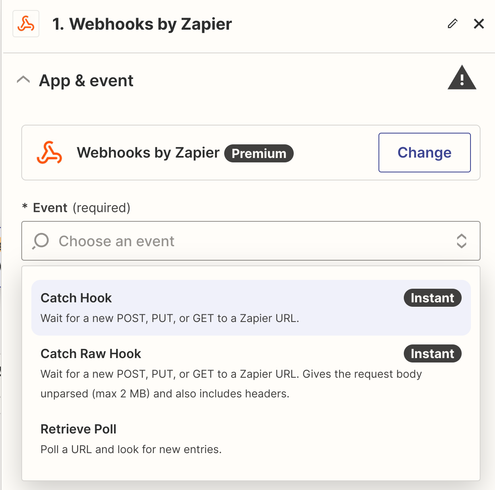
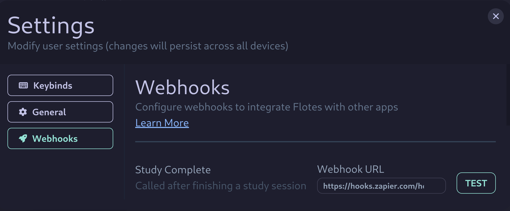
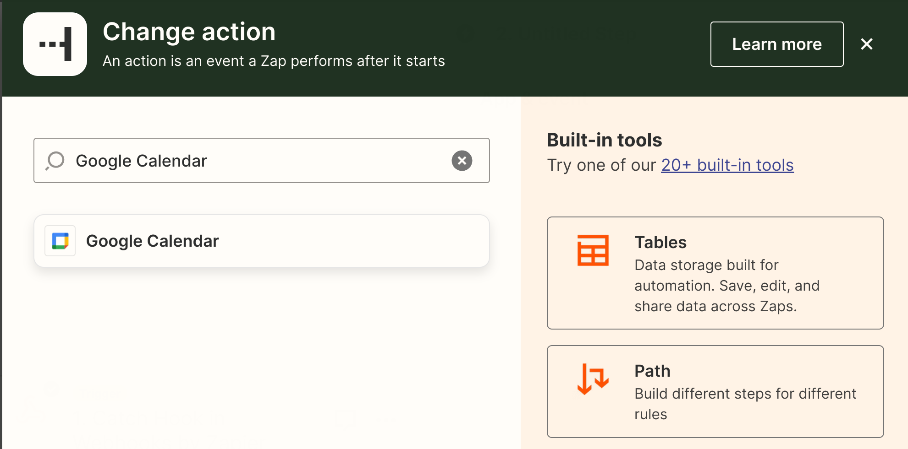
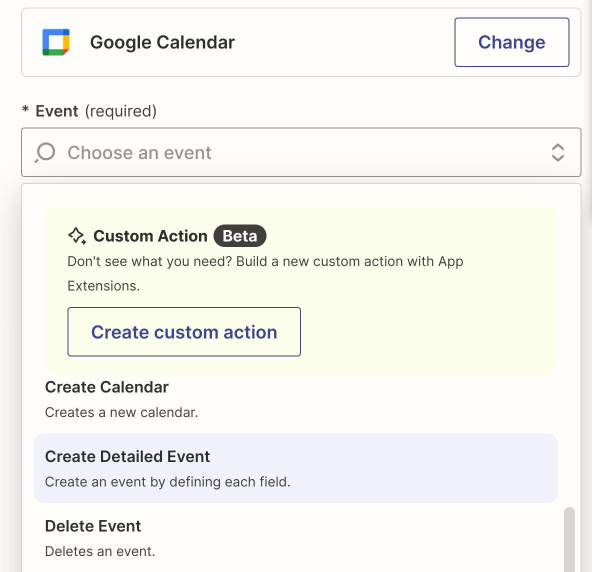
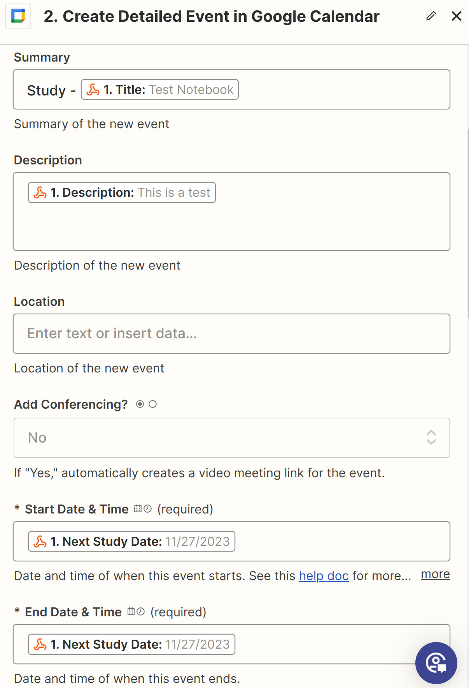
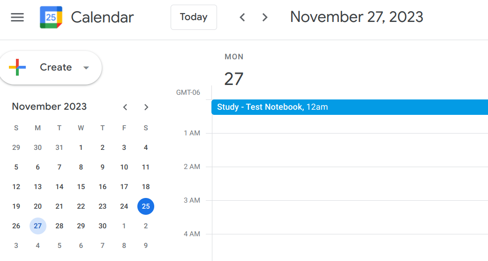

:::caution[Zapier Premium]

Since making this guide, Zapier has removed publishing webhooks for free. Since a premium Zapier account is almost 10x more expensive then a Flotes pro account, this guide is essentially deprecated.

In the meantime, we'll work on finding a free webhook solution and updating the guide.

:::

---

This is a step-by-step example of setting up a Webhook in Flotes to schedule our next study date, as a Google Calendar Event, when we complete a notebook study session. This will utilize [Zapier](), a free web application for creating automations.

:::note[Getting Help]{icon="discord"}

Setting up your first webhook can be intimidating. Webhooks seem like *magic* and that can make them difficult to understand. 

If you're stuck or having trouble, reach out for help on our [Discord](https://discord.gg/uARTASUtX2)! 

:::

### Creating Your First Webhook

Navigate to [https://zapier.com](https://zapier.com/), create an account if you don't already have one (it's free).
- **Create**: Press the "Create" button to create a new **"Zap"**. 
- **Trigger**: Select **Webhooks by Zapier**
- **Event**: Select **Catch Hook**
- **Configure**: If you see *"Pick off a Child Key"*, you can skip this step.
- **Copy URL**: Copy the URL for *Your Webhook URL*
- After copying the URL, return to Flotes and begin the next section.

#### Configuring the Webhook in Flotes

Open [Flotes](https://flotes.app/home) and navigate to your Webhook configuration (settings --> webhooks).
- **Paste Webhook URL**: Paste the URL into the input labeled **Study Complete**.
- **Test**: Press the *Test* button, you should see: Success! - Make sure the request was received
- **Verify**: In Zapier, you should see a test record found. 
- **Continue**: Press *Continue with selected record*
- In the next section, we'll configure Google Calendar

#### Setting up Google Calendar

In Zapier, after pressing *Continue with selected record*, search for and select **Google Calendar**. 
- **Authentication**: You may be prompted to authenticate after selecting.
- **Event**: Select the type of Google Calendar event you want to execute. For our example, choose **Create Detailed Event**.
- In the next section, we'll configure what information we use from Flotes to create the event.

#### Setting Values

In Zapier, when filling out the fields for the calendar, type `/`. This will list all of the fields from our test payload. You can add any formatting or plain text around those fields usage that you want.
- Once you're happy with the configuration, continue to the next section.

### Publishing the Webhook

Now we're ready to publish. You can press the *Test Step* button in Zapier to manually test the complete process. If everything is configured correctly, you should see the event in Google Calendar.

### Testing the Webhook Live

Our example used the various *Test* buttons in Flotes and Zapier to simulate an event with test data.

To use the webhook with real data, complete a study session via the [study view](/concepts/views#study-view). Once complete, Flotes will send a payload of real data to Zapier, which will then schedule our next optimal study date in our Google Calendar.

