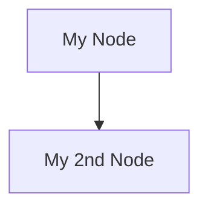

## Headings
---

Increasing the number of leading *hashtags* decreases the size of the heading.

```
# Heading 1
## Heading 2
### Heading 3
#### Heading 4
```

## Bold | Italics | Fill in the Blanks
---

:::tip[Fill in the Blanks]
Markdown reserves two forms of syntax for bold text. __two underscores__ and **two asterisks**.

Flotes repurposes the double underscore to create **fill in the blanks**. - This means that Markdown created or *imported* into Flotes will display fill in the blanks. Notes *exported* from Flotes will display bold text
:::


This is a __fill in the blank__ (in Flotes). This is **bold text**. This is *Italic text*. This is ***bold and italic text***

```
This is a __fill in the blank__ (in Flotes).
This is **bold text**.
This is *Italic text*.
This is ***bold and italic text***
```

## Block Quotes
---

> Block quotes indent text
>> You can nest block quotes
>
> Add blank indents to add paragraphs
 

```
> Block quotes indent text
>> You can nest block quotes
>
> Add blank lines to add paragraphs
```

## Lists

### Ordered

1. Steal underpants
2. ???
3. Profit!!!

```
1. Collect underpants
2. ???
3. Profit!!!
```

[South Park Reference](https://www.youtube.com/watch?v=tO5sxLapAts) :)

### Unorder

- This is a list
  - Tab to indent
- Back to the original depth

```
- This is a list
  - Tab to indent
- Back to the original depth
```

## Images | Videos | Links

To create a link wrap the label in brackets and the url in parenthesis

[Flotes App](https://flotes.app)

```
[Flotes App](https://flotes.app)
```

Video and image syntax is very similar. The only difference being an *exclamation point* at the beginning. The description will be used in the case of a broken image/video.


```

```

## Code Blocks
---

Code blocks can be syntax highlighted by adding the language to the first line

```javascript
const hello = "world"
```


> \`\`\`javascript
>
> const hello = "world"
>
> \`\`\`

### Flow Charts

Flotes enables a special type of syntax for creating Flowcharts with Markdown. To easily generate the scaffolding for a flowchart, in the Flotes editor, type `/`. This will prompt a list of built-in templates. - Then type **flowchart**




> \`\`\`mermaid
>
> graph TD;
>
> A[My Node]-->B[My 2nd Node]
> 
> \`\`\`


---

:::caution[Under Construction]

Flotes documentation is a work in progress. 
[Join the Discord](https://discord.com/invite/qKaKeGT8sZ) to get updates!

:::
