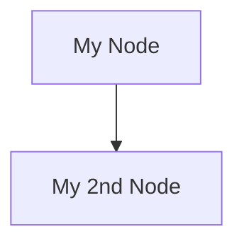

## Headings
---

Increasing the number of leading *hashtags* decreases the size of the heading.

```
# Heading 1
## Heading 2
### Heading 3
#### Heading 4
```

## Bold | Italics | Fill in the Blanks
---

:::tip[Fill in the Blanks]
Markdown reserves two forms of syntax for bold text. __two underscores__ and **two asterisks**.

Flotes repurposes the double underscore to create **fill in the blanks**. 
- Markdown created or *imported* into Flotes will display fill in the blanks
- Notes *exported* from Flotes will display bold text

:::


This is a __fill in the blank__ (in Flotes). This is **bold text**. This is *Italic text*. This is ***bold and italic text***

```
This is a __fill in the blank__ (in Flotes).
This is **bold text**.
This is *Italic text*.
This is ***bold and italic text***
```

## Lines | Hide Blocks

Markdown reserves three different syntax for creating **lines**. three underscores, three asterisks and three dashes.

:::tip[Hide Blocks]
Flotes repurposes three underscores to create **hide blocks**
- Place any text between a **set of triple underscores** to hide it during study.
:::

```
___

This is a hide block in Flotes.

But just two lines in traditional Markdown
___
```

:::tip[Effective Learning with Hide Blocks]
Using templates, you can generate notes that utilize hide blocks
- In the Flotes editor, type `/` to toggle the template prompt
  - Type `study-block` to create a engaging / recall-driven note
  - Type `details-cornell` to create a cornell note
:::

## Block Quotes
---

> Block quotes indent text
>> You can nest block quotes
>
> Add blank indents to add paragraphs
 

```
> Block quotes indent text
>> You can nest block quotes
>
> Add blank lines to add paragraphs
```

## Lists

### Ordered

1. Collect underpants
2. ???
3. Profit!!!

```
1. Collect underpants
2. ???
3. Profit!!!
```

[South Park Reference](https://www.youtube.com/watch?v=tO5sxLapAts) :)

### Unordered

- This is a list
  - Tab to indent
- Back to the original depth

```
- This is a list
  - Tab to indent
- Back to the original depth
```

## Images | Videos | Links

To create a link wrap the label in brackets and the url in parenthesis

[Flotes App](https://flotes.app)

```
[Flotes App](https://flotes.app)
```

Video, image, and gif syntax is similar. The difference being an *exclamation point* at the beginning. 
- The description will be used in the case of a broken image/video.


```

```

## Code Blocks
---

Code blocks can be syntax highlighted by adding the language to the first line

```javascript
const hello = "world"
```


> \`\`\`javascript
>
> const hello = "world"
>
> \`\`\`

### Flow Charts

Flotes enables a special type of syntax for creating Flowcharts with Markdown, called **Mermaid**. 

:::tip[Flowchart Templates]
To generate scaffolding for a flowchart
- In the Flotes editor, type `/` to toggle the template prompt
- Then type **flowchart** and press *enter*
:::




> \`\`\`mermaid
>
> graph TD;
>
> A[My Node]-->B[My 2nd Node]
> 
> \`\`\`


---

:::caution[Under Construction]

Flotes documentation is a work in progress. 
[Join the Discord](https://discord.com/invite/qKaKeGT8sZ) to get updates!

:::
